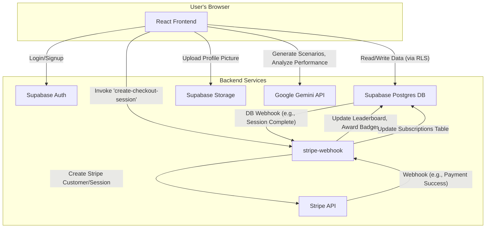
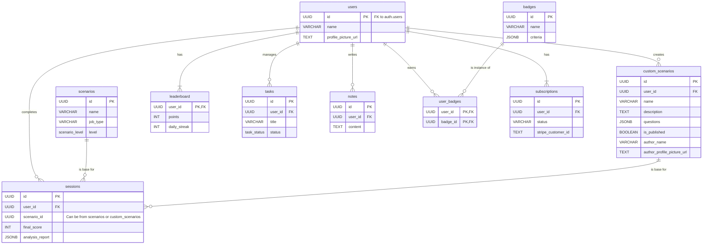

# DeepThink: AI-Powered Intuition Training Platform

DeepThink is a platform similar to Duolingo but designed to train intuition based on the user’s chosen job or field. It features AI-powered scenarios, detailed performance analysis, and competitive leaderboards, all powered by a robust Supabase backend and the Google Gemini API.

## Tech Stack

| Category      | Technology                                                              |
|---------------|-------------------------------------------------------------------------|
| **Frontend**  | React, TypeScript, Tailwind CSS, Framer Motion                          |
| **Backend**   | Supabase (Auth, Postgres DB, Storage, Edge Functions)                   |
| **AI**        | Google Gemini API                                                       |
| **Payments**  | Stripe (Integrated via Supabase Edge Functions)                         |
| **Deployment**| Vercel / Netlify (or any modern static hosting provider)                |

## System Architecture

The application uses a modern JAMstack architecture. The React frontend interacts directly with Supabase for data and authentication, while critical business logic is securely handled by server-side Edge Functions.



## Database Schema

The database is designed to be relational and scalable, with Row Level Security enabled on all tables to ensure data privacy. The `custom_scenarios` table powers both user-created "My Creations" and public "Community Challenges".



## Key Features

-   **Dynamic AI Scenarios:** Utilizes the Gemini API to generate unique official scenarios for training.
-   **Challenge Creation & Community:** Users can create their own multi-step challenges, either manually or with AI assistance. These can be kept private ("My Creations") or published for the entire community to attempt.
-   **Secure, Server-Side Scoring:** User performance is analyzed and scored, with points, streaks, and badges awarded securely via Supabase Edge Functions, preventing client-side manipulation.
-   **In-Depth Performance Analysis:** AI-driven feedback on user decisions, including cognitive bias detection, performance metrics, and a shareable summary report.
-   **Gamified Task Hub:** A personal Kanban board where users can manage their development goals, earning "Discipline XP" and leveling up by completing tasks.
-   **AI Task Breakdown:** Users can input a high-level goal (e.g., "Launch new feature") and have the Gemini API break it down into smaller, actionable sub-tasks.
-   **User Notes with AI Suggestions:** A personal space for users to reflect on their learnings, with an AI assistant that provides deeper insights based on the note's content.
-   **Competitive Leaderboards & Badges:** Global leaderboards, weekly leagues, and a wide array of achievements encourage consistent engagement.
-   **Secure Authentication & Profiles:** Managed by Supabase Auth (Email/Pass, OAuth) with customizable public profiles and secure avatar uploads via Supabase Storage.
-   **Subscription Management:** Seamless subscription handling with Stripe, managed by secure webhooks and Edge Functions.

## Local Development Setup

Follow these steps to set up the project for local development.

1.  **Clone the repository:**
    ```bash
    git clone <repository-url>
    cd deepthink-mvp
    ```

2.  **Install dependencies:**
    This project uses a standard Node.js environment.
    ```bash
    npm install
    ```

3.  **Set up Supabase Backend:**
    - Go to your Supabase project's SQL Editor.
    - Copy the entire content of `supabase.md` and run it as a new query. This will set up all tables and security policies.
    - Go to Storage and create a new bucket named `profile_pictures`. Make it a public bucket. Apply the RLS policies documented in `supabase.md` to secure uploads.

4.  **Set up Environment Variables:**
    - Create a new file named `.env.local` in the project root.
    - Copy the contents of `.env.example` (if available) or add the following variables, replacing the placeholder values with your actual keys from your Supabase and Google AI project dashboards.
    ```
    # Supabase
    REACT_APP_SUPABASE_URL=https://<your-project-ref>.supabase.co
    REACT_APP_SUPABASE_ANON_KEY=<your-supabase-anon-key>

    # Google Gemini
    REACT_APP_API_KEY=<your-google-gemini-api-key>
    ```

5.  **Deploy Supabase Edge Functions:**
    - Install the Supabase CLI: `npm install supabase --save-dev`
    - Link your project: `npx supabase login` followed by `npx supabase link --project-ref <your-project-ref>`
    - Deploy the functions: `npx supabase functions deploy`
    - In your Supabase project dashboard, configure secrets for the Edge Functions (Stripe keys, etc.).

6.  **Run the development server:**
    ```bash
    npm run dev
    ```
    The application should now be running locally, connected to your live Supabase backend.